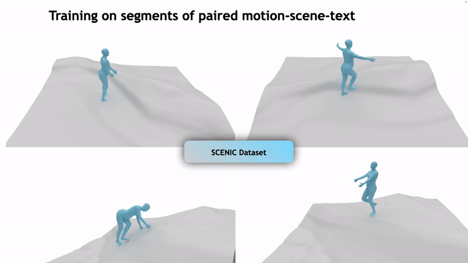

# SMPL on terrain (SCENIC Dataset)

Pairing up your human motion with terrains to build height-adaptive motion models? This repository contains the **SCENIC dataset** for **motion-scene-text** data sequences, enabling research in motion modeling and scene-aware control.



## Dataset Overview

You can download the necessary components from the following links:
- **SCENIC Dataset**: [Download here](https://drive.google.com/file/d/1YdjEj1XIA_Nck54u_njminoMJzjCgeXN/view?usp=sharing)
- **Terrain Asset**: [Download here](<https://drive.google.com/file/d/14rdGYbPMSpgQCsK3mnjZC6UkVV_AVEPC/view?usp=sharing>)

### Breakdown of the Dataset:
- `npz/`: Contains original motion sequences in the **SMPL** format.
- `pkl/`: Contains the split motion segments used for fitting to terrains.
- `text/`: Contains text annotations for various styles of motion for each motion segment.

## Using the Dataset

1. To preprocess and visualize the dataset, run:
   ```bash
   python process_and_visualize.py
   ```

2. The paired terrains will be saved as **watertight meshes** in the `scenes/` directory.

## Credit

Credit to **Phase-functioned Neural Network (PFNN)** for providing the terrain asset and the fitting mechanism. 

## Citation

If you use the SCENIC dataset or our code in your research, please cite us:

```bibtex
@article{zhang2024scenic,
    title = {SCENIC: Scene-aware Semantic Navigation with Instruction-guided Control},
    author = {Zhang, Xiaohan and Starke, Sebastian and Guzov, Vladimir and Dhamo, Helisa and Pérez Pellitero, Eduardo and Pons-Moll, Gerard},
    booktitle = {Arxiv},
    year = {2024},
}

@article{pfnn,
    author = {Daniel Holden and Taku Komura and Jun Saito},
    title = {Phase-functioned neural networks for character control},
    journal = {{ACM} Trans. Graph.},
    year = {2017}
}
```